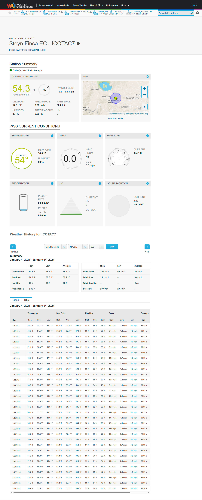

## Webscraping Weather Underground by station with R and RSelenium

Weather Underground provides local & long-range weather forecasts, weather reports, maps & tropical weather conditions for locations worldwide.

On this site we can obtain daily data (up to hourly) of the maximum, minimum and average of:

Temperature

Dew Point

Humidity

Speed

Pressure

Precip. Accum.

## Url estructure

[https://www.wunderground.com/dashboard/pws/](https://www.wunderground.com/dashboard/pws/ISANMI50%22) Station "/table/" date from / date to / type

Type can be daily (1 register per hour), weekly or monthly (1 register per day)

Query by day

<https://www.wunderground.com/dashboard/pws/ICOTAC7/table/2024-01-8/2024-01-8/monthly>

